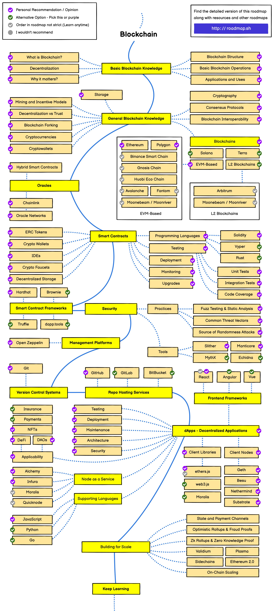

[Blockchain 101 - A Visual Demo](https://www.youtube.com/watch?v=_160oMzblY8&t=44s) - This is a very basic visual introduction to the concepts behind a blockchain. We introduce the idea of an immutable ledger using an interactive web demo.

[Public / Private Keys and Signing](https://www.youtube.com/watch?v=xIDL_akeras) - We build on the concepts from the previous video and introduce public / private key pairs and signing using an interactive web demo.

[Blockchains: how can they be used? (Use cases for Blockchains)](https://www.youtube.com/watch?v=aQWflNQuP_o)

[Proof-of-Stake (vs proof-of-work)](https://www.youtube.com/watch?v=M3EFi_POhps)