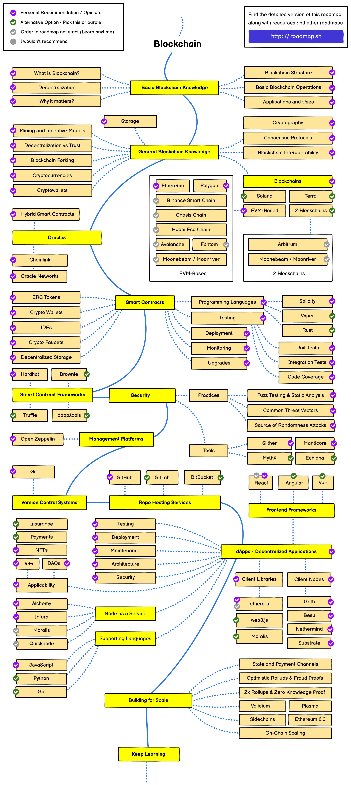

# Web3 Wisdom Vault

Welcome to the Web3 Wisdom Vault! This repository serves as a comprehensive knowledge base for Web3 technologies, concepts, and applications.

The project is still in its initial stage, and it is a compilation of the materials I use to learn about web3 along the way.

## 📚 About
Web3 Wisdom Vault is a curated collection of learning materials, insights, and resources related to Web3. Our goal is to provide a structured and accessible way for both beginners and advanced users to explore and understand the Web3 ecosystem.

## 🌟 Features
- In-depth explanations of Web3 concepts
- Tutorials on blockchain, cryptocurrencies, and decentralized applications (dApps)
- Case studies of successful Web3 projects
- Latest trends and developments in the Web3 space
- Glossary of Web3 terminology

## 👌🏻 Todolist
- [ ] Add more resources and materials
- [ ] Add more case studies
- [ ] Add more tutorials
- [ ] Add more explanations
- [ ] Add more glossary
- [ ] Categorize content
- [ ] Improve directory structure
- [ ] Improve README
- [ ] Improve contributing guide

## 📋 Table of Contents

1. [Learning Road Map](#Learning-Road-Map)
2. [YouTube Channel](#YouTube-Channel)
3. [Website](#Website)
4. [Tutorial](#Tutorail)
5. [Crypto Wallets](#Crypto-Wallets)
6. [Protocol](#Protocol)

---
## Learning Road Map 

- ⭐⭐⭐[Developer Roadmaps](https://roadmap.sh/) - A curated list of roadmaps, guides and other educational content to help guide developers in picking up a path and guide their learning
- [DeFi-Developer-Road-Map](https://github.com/OffcierCia/DeFi-Developer-Road-Map?tab=readme-ov-file)
- [blockend-developer-roadmap](https://github.com/Envoy-VC/blockend-developer-roadmap)
  
## YouTube Channel

- [Chainlink](https://www.youtube.com/c/chainlink/playlists) - Chainlink is the universal platform for builders and financial institutions pioneering the future of global markets onchain.
- [Dapp University](https://youtube.com/c/DappUniversity) - Learn to build decentralized apps on Ethereum Blockchain and smart contracts hacking tutorials.
- [Whiteboard Crypto](https://www.youtube.com/@WhiteboardCrypto/featured) - It offers clear and concise explanations of complex cryptocurrency and blockchain concepts through engaging whiteboard-style animated videos.
- [Coinbase](https://www.youtube.com/@coinbase/videos) - Coinbase is one of the largest and most well-known cryptocurrency exchanges and financial services platforms in the world.

## Tutorail
- [LearnWeb3](https://learnweb3.io/) - LearnWeb3 is the leading educational ecosystem in Web3. They offer a wide range of educational courses, resources, and tools that are designed to help developers learn and grow in the Web3 space.
- [CryptoZombies](https://cryptozombies.io) - Interactive school that teaches you all things technical about blockchains.

## Website

- [Defillama](https://defillama.com/) - Finematics delivers in-depth, animated explanations of decentralized finance (DeFi) protocols and Web3 concepts, providing viewers with a comprehensive understanding of complex blockchain ecosystems and financial mechanisms.
- [uniswap](https://uniswap.org/) - Developers, traders, and liquidity providers participate together in a financial marketplace that is open and accessible to all.
- [chainlist](https://chainlist.org/) - ChainList is a list of EVM networks. Users can use the information to connect their wallets and Web3 middleware providers to the appropriate Chain ID and Network ID to connect to the correct chain.

## Protocol

- [WalletConnect](https://walletconnect.com/) - An open protocol that enables wallets to connect to DApps via QR code scanning, widely supported across various wallet applications.
- [uniswap protocol](https://uniswap.org/) - the automated market maker (AMM) model in decentralized finance (DeFi).

---
## 📞 Contact
For any questions or suggestions, please open an issue in this repository or contact the maintainers at [irontom233@gmail.com].

Happy learning, and welcome to the exciting world of Web3!

